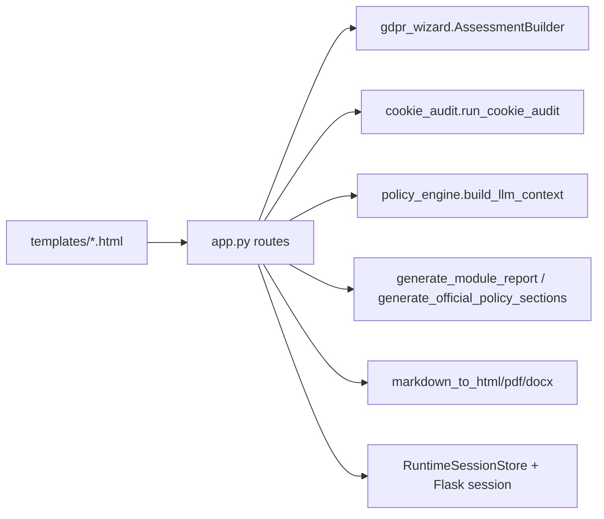

# Codebase Module Inventory

1. Web/API orchestration (`app.py`)
2. Questionnaire + scoring core (`gdpr_wizard.py`)
3. Cookie compliance audit engine (`cookie_audit.py`)
4. Policy context normalization (`policy_engine/context.py`, `site_inspector.py`)
5. LLM policy/report generation (`policy_engine/module_reports.py`, `policy_engine/official_policy.py`, `policy_engine/text_quality.py`, `llm.py`)
6. Rendering/export pipeline (`policy_engine/rendering.py`)
7. Runtime state + persistence helpers (`runtime_store.py`, `policy_engine/storage.py`)
8. Configuration + validation (`platform_config.py`, `policy_engine/config.py`, `validators.py`)
9. Frontend UI templates (`templates/*.html`)

