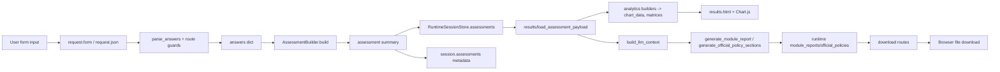

# Module: Web/API Orchestration (`app.py`)

## A) Module Architecture Diagram
```mermaid
flowchart LR
  subgraph UI[UI Templates]
    TLogin[login.html]
    THome[home.html]
    TAssess[assessment_form.html]
    TResults[results.html]
    TCookie[cookie_audit.html]
    TPolicy[official_policy.html]
  end

  subgraph Routes[Flask Routes in app.py]
    RLogin[login/logout]
    RHome[home]
    RAssess[assessment_form(mode)]
    RAuto[autofill_assessment(mode)]
    RResults[results]
    RCookie[cookie_audit_view/toggle_cookie_audit]
    RReports[create_module_report/download_module_report/export_assessment]
    RPolicy[official_policy_page/download_official_policy/profile/comments]
  end

  subgraph Helpers[Core Helpers]
    HParse[parse_answers]
    HRun[run_assessment]
    HSave[save_assessment_files]
    HLoad[get_session_assessment/load_assessment_payload]
    HCharts[build_radar_payload/build_risk_matrix/build_correlation_matrix/etc]
    HMerge[combined_assessment_inputs/merge_assessments]
  end

  subgraph State[Runtime State]
    SSession[Flask session]
    SRuntime[RuntimeSessionStore bucket]
  end

  subgraph Services[Imported Services]
    GEngine[gdpr_wizard.AssessmentBuilder]
    CEngine[cookie_audit.run_cookie_audit]
    PContext[policy_engine.build_llm_context]
    PModule[policy_engine.generate_module_report]
    POfficial[policy_engine.generate_official_policy_sections]
    Render[markdown_to_html/pdf/docx + send_file]
  end

  UI --> Routes
  RAssess --> HParse --> HRun --> GEngine
  HRun --> HSave --> SRuntime
  HSave --> SSession
  RResults --> HLoad --> SRuntime
  RResults --> HCharts
  RCookie --> CEngine
  RReports --> PContext --> PModule
  RPolicy --> HMerge --> POfficial
  RReports --> Render
  RPolicy --> Render
  Routes --> UI
```

## B) Function-Level Execution Flow
```mermaid
flowchart TD
  A1[POST /assessment/<mode> -> assessment_form] --> A2[parse_answers(bundle.questions, request.form)]
  A2 -->|errors| A3[render assessment_form with errors + state]
  A2 -->|ok| A4[run_assessment(mode,bundle,answers)]
  A4 --> A5[save_assessment_files(mode,answers,assessment)]
  A5 --> A6[session.assessments[mode] = entry]
  A6 --> A7[redirect /results]

  B1[GET /results -> results] --> B2[get_session_assessment for dpia11/gap]
  B2 --> B3[rebuild_assessment_from_entry + render_markdown fallback]
  B3 --> B4[combined_summary]
  B4 --> B5[build_radar_payload/build_article_chart_payload/build_risk_scatter_payload/build_section_risk_payload]
  B5 --> B6[extract_failure_points + aggregate_annex_failures + build_risk_matrix]
  B6 --> B7[load_module_report_text + markdown_to_html]
  B7 --> B8[render results.html]

  C1[POST /module-report/<mode>] --> C2[get_session_assessment + rebuild_assessment_from_entry]
  C2 --> C3[optional summarize_cookie_audit]
  C3 --> C4[build_llm_context]
  C4 --> C5[generate_module_report]
  C5 --> C6[runtime_store.module_reports[mode] = report]
  C6 --> C7[redirect /results#module-report-<mode>]

  D1[POST /official-policy] --> D2[combined_assessment_inputs]
  D2 --> D3[optional summarize_cookie_audit]
  D3 --> D4[generate_official_policy_sections]
  D4 --> D5[hash_text + markdown_to_html + markdown_to_pdf_bytes]
  D5 --> D6[runtime_store.official_policies[run_id] = policy artifacts]
  D6 --> D7[session.official_policy_run = run_id]
  D7 --> D8[redirect /official-policy]
```

## C) Data Flow


## D) Score/Calculation Flow (Analytics-Level)
```mermaid
flowchart TD
  I1[dpia_assessment + gap_assessment] --> C1[combined_summary]
  C1 --> C1a[average_percent = avg(module percents)]
  C1 --> C1b[risk_count = unique high_risk_indicators]
  C1 --> C1c[coverage_gaps = len(dpia.gaps)+len(gap.gaps)]

  I1 --> C2[_collect_field_scores]
  C2 --> C3[build_radar_payload]
  C3 --> C3a[field score = avg(section.percent by keyword bucket)]

  I1 --> C4[_article_scores_from_assessment]
  C4 --> C5[build_article_chart_payload]
  C5 --> C5a[article score = avg(section.percent over referencing questions)]

  C3 --> C6[build_correlation_matrix]
  C6 --> C6a[matrix[a,b] = 1 - abs(score_a-score_b)/100]

  I1 --> C7[extract_failure_points]
  C7 --> C8[build_risk_matrix]
  C8 --> C8a[impact via keyword map]
  C8 --> C8b[likelihood via keyword map]

  I1 --> C9[build_risk_scatter_payload]
  C9 --> C9a[x = coverage gaps, y = high-risk indicators, r = max(6, percent/5)]

  I1 --> C10[build_section_risk_payload]
  C10 --> C10a[section risk = 100 - section.percent]
```
