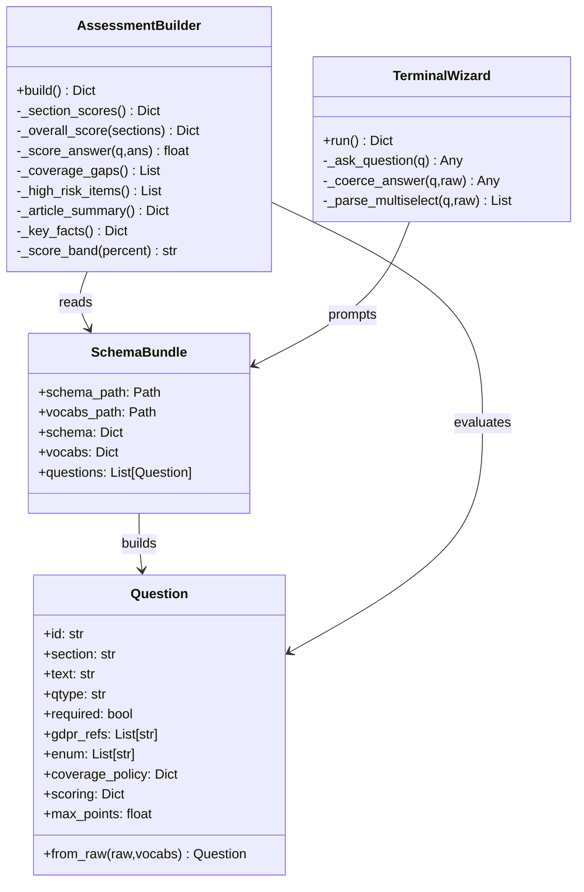
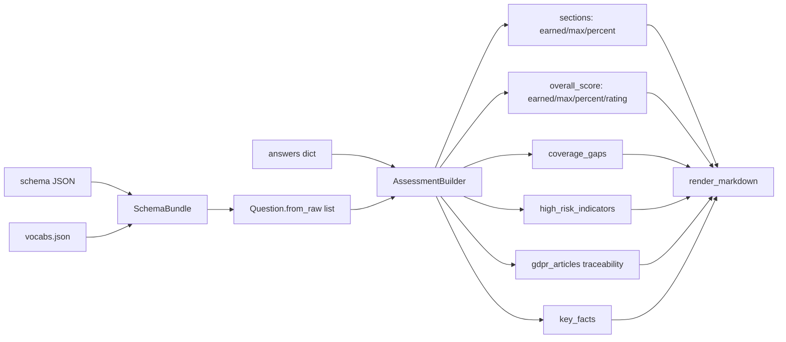

# Module: Questionnaire + Scoring Core (`gdpr_wizard.py`)

## A) Module Architecture Diagram


## B) Function-Level Execution Flow
```mermaid
flowchart TD
  B0[AssessmentBuilder(bundle,answers)] --> B1[build]
  B1 --> B2[_section_scores]
  B2 --> B2a[_score_answer per scored question]
  B1 --> B3[_overall_score(sections)]
  B3 --> B3a[_score_band -> Strong/Adequate/Needs Improvement/High Risk]
  B1 --> B4[_coverage_gaps]
  B1 --> B5[_high_risk_items]
  B1 --> B6[_article_summary]
  B1 --> B7[_key_facts]
  B1 --> B8[return assessment summary dict]

  C0[CLI mode] --> C1[parse_args]
  C1 --> C2[resolve_schema]
  C2 --> C3[SchemaBundle(schema,vocabs)]
  C3 --> C4[TerminalWizard.run -> answers]
  C4 --> C5[AssessmentBuilder.build]
  C5 --> C6[write_outputs answers/assessment/markdown]
```

## C) Data Flow


## D) Score Calculation Flow
```mermaid
flowchart TD
  I1[for each question q] --> D1{q.scoring exists AND answer present?}
  D1 -->|No| D2[skip]
  D1 -->|Yes| D3[_score_answer(q, ans)]

  D3 --> D3a{answer is list?}
  D3a -->|Yes| D3b[score = sum q.scoring[item] for selected items]
  D3a -->|No| D3c[score = q.scoring[str(ans).upper]]

  D3b --> D4[section.earned += score]
  D3c --> D4
  D4 --> D5[section.max += q.max_points (default 1.0)]

  D5 --> D6[section.percent = round(earned/max*100,1)]

  D6 --> O1[total_earned = sum section.earned]
  D6 --> O2[total_max = sum section.max]
  O1 --> O3[overall.percent = round(total_earned/total_max*100,1)]
  O2 --> O3

  O3 --> B1{percent >= 85}
  B1 -->|Yes| R1[rating Strong]
  B1 -->|No| B2{percent >= 70}
  B2 -->|Yes| R2[rating Adequate]
  B2 -->|No| B3{percent >= 50}
  B3 -->|Yes| R3[rating Needs Improvement]
  B3 -->|No| R4[rating High Risk]
```

## Implementation Note
- Schema `weights` and `map` fields exist in JSON, but current scoring uses only `q.scoring` and `q.max_points`.
