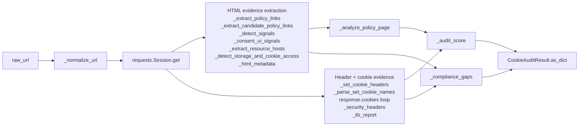
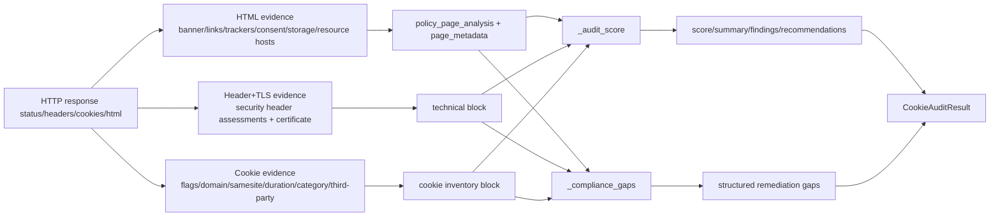

# Module: Cookie Compliance Audit Engine (`cookie_audit.py`)

## A) Module Architecture Diagram


## B) Function-Level Execution Flow
```mermaid
flowchart TD
  R0[run_cookie_audit(raw_url)] --> R1[_normalize_url]
  R1 --> R2{url empty?}
  R2 -->|Yes| R3[return score=0 no-url payload]
  R2 -->|No| R4[session_client.get(url)]

  R4 -->|RequestException| R5[return score=0 unreachable payload]
  R4 -->|OK| R6[extract html/final_url/hostname]

  R6 --> R7[_extract_policy_links]
  R6 --> R8[_extract_candidate_policy_links]
  R6 --> R9[_consent_ui_signals + banner_context]
  R6 --> R10[_extract_resource_hosts]
  R6 --> R11[_detect_signals trackers + consent tools]
  R6 --> R12[_detect_storage_and_cookie_access]
  R7 --> R13[_analyze_policy_page]
  R6 --> R14[_html_metadata]

  R4 --> R15[_security_headers(response.headers)]
  R6 --> R16[_tls_report]
  R16 --> R17[https fallback if probe fails]

  R4 --> R18[_set_cookie_headers -> _parse_set_cookie_names]
  R4 --> R19[response.cookies loop -> cookie entries + long_lived + http_only_gaps + mismatch]

  R9 --> R20[_audit_score]
  R13 --> R20
  R15 --> R20
  R17 --> R20
  R19 --> R20

  R9 --> R21[_compliance_gaps]
  R13 --> R21
  R15 --> R21
  R17 --> R21
  R19 --> R21
  R14 --> R21

  R20 --> R22[build CookieAuditResult]
  R21 --> R22
  R22 --> R23[return dict]
```

## C) Data Flow


## D) Score Calculation Flow
```mermaid
flowchart TD
  S0[score = 100] --> S1{reachable?}
  S1 -->|No| S2[score=0 immediate return]
  S1 -->|Yes| S3[apply penalties]

  S3 --> P1[-40 cookies and no banner]
  S3 --> P2[-8 banner but no granular choices]
  S3 --> P3[-30 cookies and no policy links]
  S3 --> P4[-min(12,3*missing_disclosures)]
  S3 --> P5[-10 insecure cookies]
  S3 --> P6[-10 third-party cookies]
  S3 --> P7[-min(20,5*missing_security_headers)]
  S3 --> P8[-min(10,3*weak_security_headers)]
  S3 --> P9[-10 tls invalid OR -5 cert<30 days]
  S3 --> P10[-5 long-lived cookies >395 days]
  S3 --> P11[-5 httpOnly gaps for sensitive cookies]
  S3 --> P12[-10 trackers and no banner]
  S3 --> P13[-6 third-party hosts and no banner]
  S3 --> P14[-8 document.cookie write and no banner]
  S3 --> P15[-3 Set-Cookie mismatch]

  P1 --> S4[score = clamp 0..100]
  P2 --> S4
  P3 --> S4
  P4 --> S4
  P5 --> S4
  P6 --> S4
  P7 --> S4
  P8 --> S4
  P9 --> S4
  P10 --> S4
  P11 --> S4
  P12 --> S4
  P13 --> S4
  P14 --> S4
  P15 --> S4

  S4 --> B1{score >= 80}
  B1 -->|Yes| T1[Strong compliance posture]
  B1 -->|No| B2{score >= 50}
  B2 -->|Yes| T2[Partial compliance]
  B2 -->|No| T3[High compliance risk]
```
