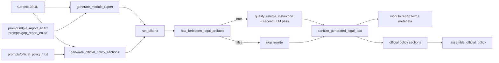

# Module: LLM Policy/Report Generation (`policy_engine/module_reports.py`, `policy_engine/official_policy.py`, `llm.py`, `policy_engine/text_quality.py`)

## A) Module Architecture Diagram


## B) Function-Level Execution Flow
```mermaid
flowchart TD
  G1[generate_official_policy_sections(answers,assessment,overrides)] --> G2[build_llm_context]
  G2 --> G3[ctx_json = json.dumps(context)]
  G3 --> G4[loop each OFFICIAL_POLICY_PROMPTS slug]

  G4 --> G5[_load_prompt_text().replace('{ctx}', ctx_json)]
  G5 --> G6{override exists for slug?}
  G6 -->|Yes| G7[append override guidance]
  G6 -->|No| G8[use base prompt]

  G7 --> G9[run_ollama(prompt_text)]
  G8 --> G9

  G9 --> G10{has_forbidden_legal_artifacts?}
  G10 -->|Yes| G11[run_ollama(repair prompt)]
  G10 -->|No| G12[keep content]

  G11 --> G13[sanitize_generated_legal_text]
  G12 --> G13
  G13 --> G14[sections.append slug/title/content]

  G14 --> G15[_assemble_official_policy(context,sections)]
  G15 --> G16[context_hash = hash_text(ctx_json)]
  G16 --> G17[return context, sections, markdown_text, context_hash]
```

## C) Data Flow
```mermaid
flowchart LR
  A1[answers + assessment + overrides] --> C1[build_llm_context]
  C1 --> J1[ctx_json]
  J1 --> P1[prompt templates with {ctx} replacement]
  P1 --> M1[run_ollama output]

  M1 --> Q1[quality detection + sanitization]
  Q1 --> S1[module report text]
  Q1 --> S2[official policy section text]

  S2 --> A2[_assemble_official_policy -> markdown]
  A2 --> A3[markdown_to_html]
  A2 --> A4[markdown_to_pdf_bytes]

  S1 --> ST1[runtime_store.module_reports]
  A2 --> ST2[runtime_store.official_policies]
  ST1 --> D1[module report downloads]
  ST2 --> D2[official policy downloads]
```

## D) Score Calculation
- Not applicable. This module generates narrative/policy text and performs quality rewriting/sanitization.
