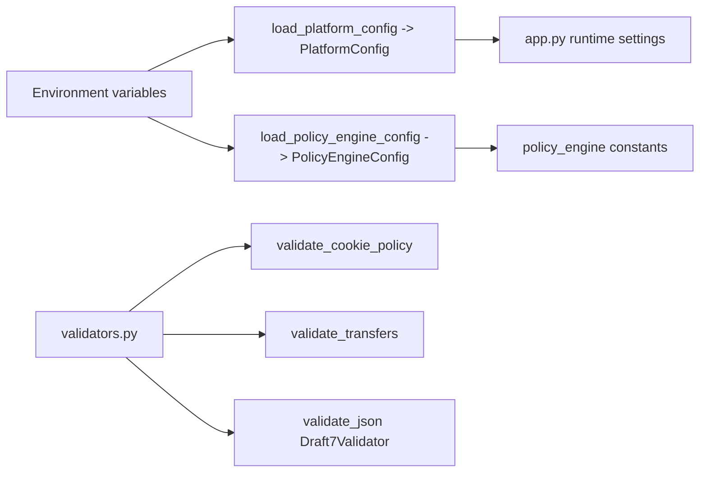
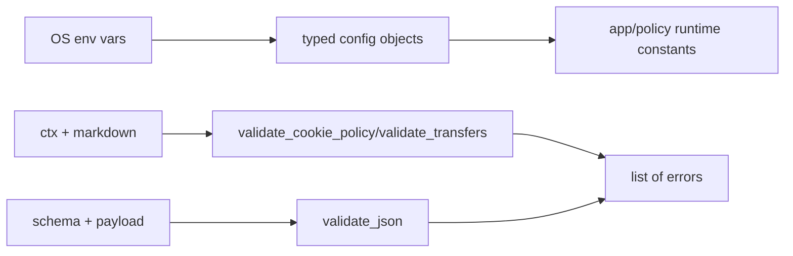

# Module: Configuration + Validation (`platform_config.py`, `policy_engine/config.py`, `validators.py`)

## A) Module Architecture Diagram


## B) Function-Level Execution Flow
```mermaid
flowchart TD
  C1[load_platform_config] --> C2[_to_positive_int for SESSION_RUNTIME_TTL_SECONDS]
  C2 --> C3[PlatformConfig(secret,user,pass,token,ttl)]

  C4[load_policy_engine_config] --> C5[ensure output directories]
  C5 --> C8[PolicyEngineConfig(model,prompts,official_dir,pandoc,regex)]

  V1[validate_transfers(ctx,md_text)] --> V2[_detect_non_eea_transfers]
  V2 --> V3{outside EEA and no SCC phrase?}
  V3 -->|Yes| V4[return validation error]
```

## C) Data Flow


## D) Score Calculation
- Not applicable. This module handles configuration and validation rules.
