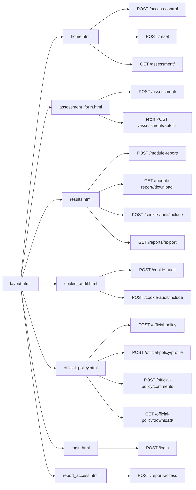
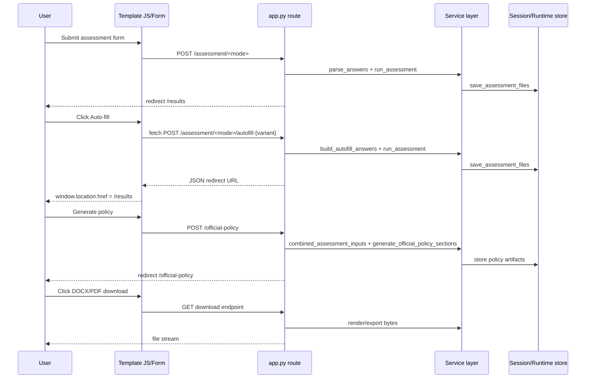
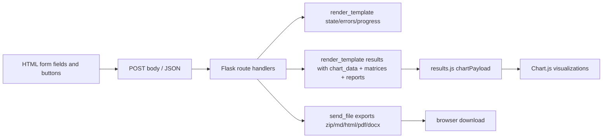

# Module: Frontend UI + Frontend↔Backend Flows (`templates/*.html`)

## A) Module Architecture Diagram

## B) Function-Level Interaction Sequence

## C) Data Flow

## D) Score Calculation
- Not applicable in frontend. UI renders scores and analytics calculated on backend.
